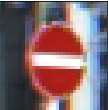
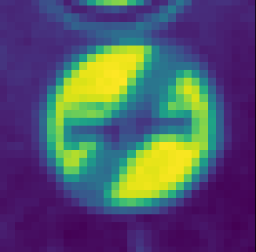
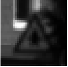
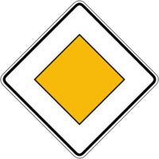
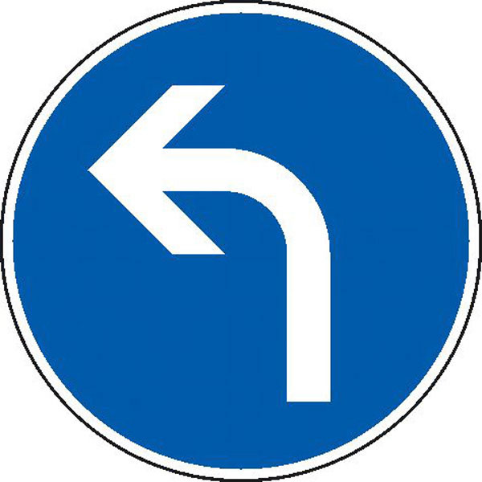

# Traffic Sign Classifier 

## Basic Overview

The objective of this project was to train a convolutional neural network to accurately identify a set of 43 German Traffic Signs based on data set given

#### Data Summary and Exploration

I used the numpy libary to the statistics of the data sets:

Dataset | Size
| ------------- |:-------------:|
|Training Set | 34799|
|Validation Set | 4410|
|Test Set | 4410|
|Number of Unique Classes| 43|

#### Visual of the Training Data Set

#### Preprocessing the Data
The first thing to do was preprocess the images.  Other than the suggestion of normalizing it with formula (X_train - 128) / 128, I grayscaled it into 1 layer. I never would have thought use the formula but we want to have the data at a 0 and equal variance, and one our little tips from the project guidelines helped with this.  I took it a step further and grayscaled the images to get rid of the RGB layers.

Here is an example the before and after of an image in the data set after preprocessing it.

#### Augmenting the Images

I wasn't really going anywhere with just the preprocessing and the CNN, as my best validation score was at 78%, and my testing score was at 82%, so I did research online and came across a bunch of explanations to augment the data. From there as you can see I randomized the data according to the number given while training the data set.  

I used the OpenCV library and the Scikit library randomize changes in pixels/contrast to images:  

* Guassian Blur
* Affine Transformation
* Random Noise

#### After Augmenting 

I changed the EPOCHS from 10 to 40 and Batch Size a little down to 120, I started seeing better results.  I also changed the learning rate from .00001 to .0001. When testing the validation accuracy.  I got 89% around the 10 EPOCH and remained until the 40th, increasing and decreasing, which clearly indicated overfitting.  I started using Dropout in the end of my LaNet architecture but it only made it worse.  Then I used it in the beginning and it helped much more, which increased my validation score to 93%.

#### Final scores: 
* Training Accuracy (N/A) 
* Validation Accuracy (93.2%) 
* Testing Accuracy (93.5%)

#### Iterative Approach
I started the architecture from the LaNet lab and added more layers there.  The majority of the Convolutional Layers were activated by a Relu function, which was immediately followed by Max Pooling. There were benefits with adding extra layers of Fully Connected Layers, and I so I kept adding them until the accuracy score started dropping. 
* I experimented by adding an extra layer at a time 
* I chose a CNN because it is great for image recognition
* I decided first what I wanted my Output layer to be, and then I chose my weights according to that, not vice versa.

### Layer Architecture:

Layer | Description
| ------------- |:-------------:|
|Input | 32 32 1|
|Convolutional 3x3 | Output 30x30x10|
|Relu |         |
|Convolutional 3x3 | Output 28x28x100|
|Relu |           |
|Max Pool | Output 14x14x100|
|Convolutional 5x5 | Output 10x10x150|
|Relu |         |
|Max Pool | Output 5x5x150|
|Convolutional 2x2 | Output 4x4x250|
|Relu |         |
|Max Pool | Output 2x2x250|
|Relu |         |
|Convolutional 2x2 | Output 1x1x1000|
|Relu|        |
|Fully Connected | Output 500|
|Relu |       |
|Fully Connected | Output 300|
|Relu|      |
|Fully Connected | Output 120|
|Relu |       |
|Fully Connected | Output 84|
|Relu |     |
|Full Connected | Output 43|
|Softmax_Cross_Entropy |    |

### Testing Internet Images

Here is an example of the images before and after grayscaling it.  I converted the images to Grayscale and normalized it because a that was the way I trained my data so I concluded it would be the best way to recognize the image. 

#### Here are the rest of the images

#### . I got a 100% confidence in each of the choices for the photos.  This is something I realized I needed to work on:  Data visualizing, took a lot of blog posts and stack overflow to help me even on the most blantaly obvious answers.

### Overall, great experience 
